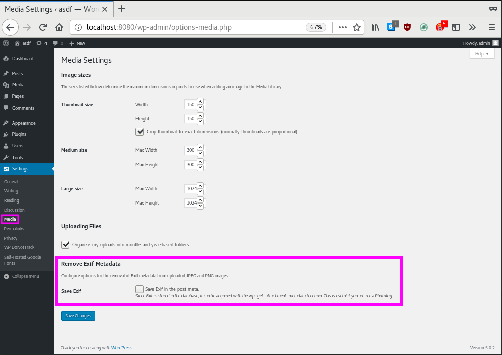

VA Removing Exif
==============================

Automatically remove all Exif data from new JPEG and PNG images when uploading.

## Description

Automatically remove all Exif data from the JPEG and PNG images when uploading.

Exif data can optionally be saved as metadata separately.

Please note that already uploaded images will not be processed. If you want to delete Exif from the already uploaded image, please generate thumbnail image again with "[Regenerate Thumbnails](https://ja.wordpress.org/plugins/regenerate-thumbnails/)" etc.

### How to use

Usage is easy. Just activate the plugin. This plugin requires PHP modules of the ImageMagick or GD.

### Requires
* WordPress 4.4+
* PHP 5.4+ & ImageMagick or GD modules

### Attention

This plugin is intended to save your privacy and should not be used for illegal activity like copyright violations.

## Installation

To install VA Removing Exif:

1. Upload the "va-removing-exif" directory and all its contents to your `/wp-content/plugins/` directory.
2. Activate the plugin through the 'Plugins' menu in WordPress.
3. Optimize your setting through the "Settings > Media" menu in WordPress.

## Screenshots

  
**1. Settings > Media.**

## Changelog

### 1.0.2
* Added support for PNG images
* Added [@dim-0](https://profiles.wordpress.org/lmika/) to contributors.
* Minor adjustments to option page
* Added german translation

### 1.0.1
* Update description.
* Added [@mayukojpn](https://profiles.wordpress.org/mayukojpn/) to contributors.

### 1.0.0
* First public release.
